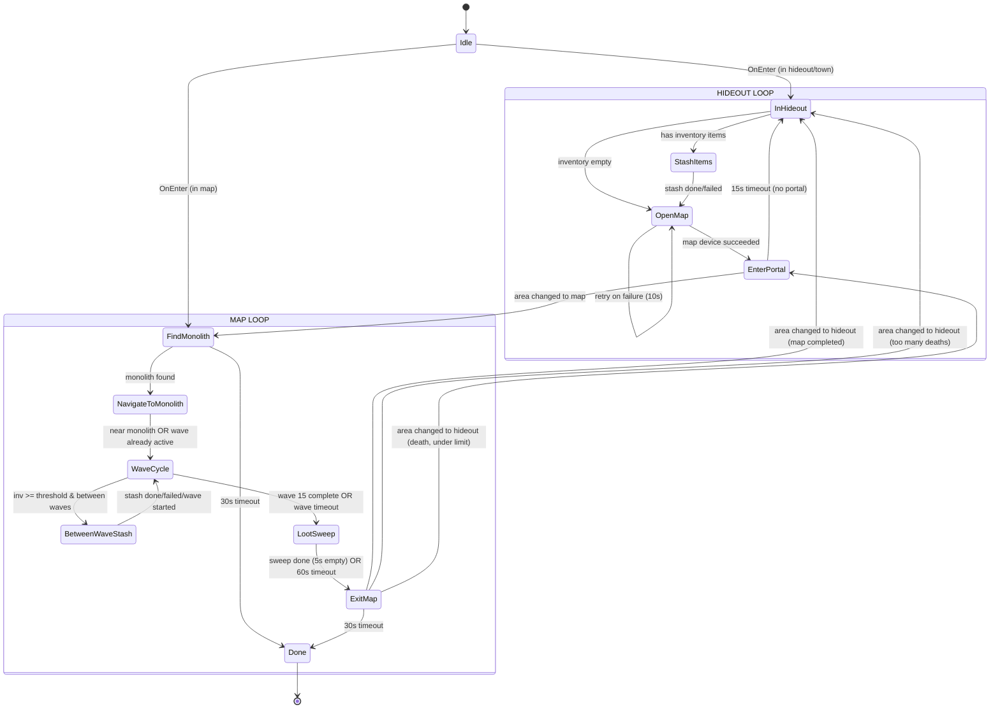
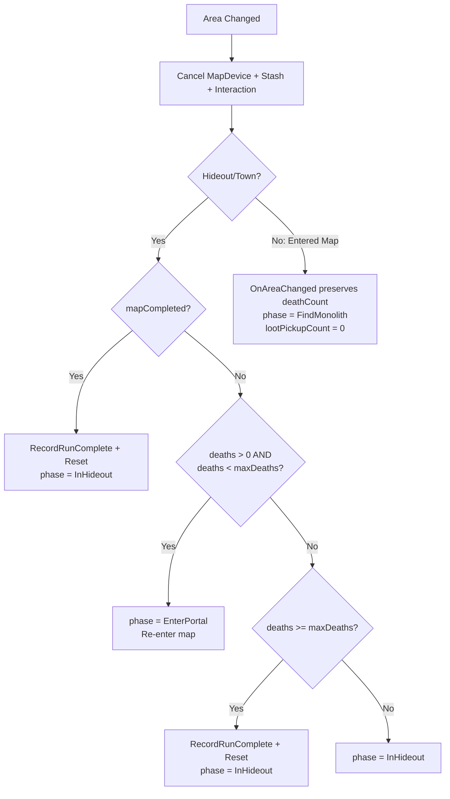
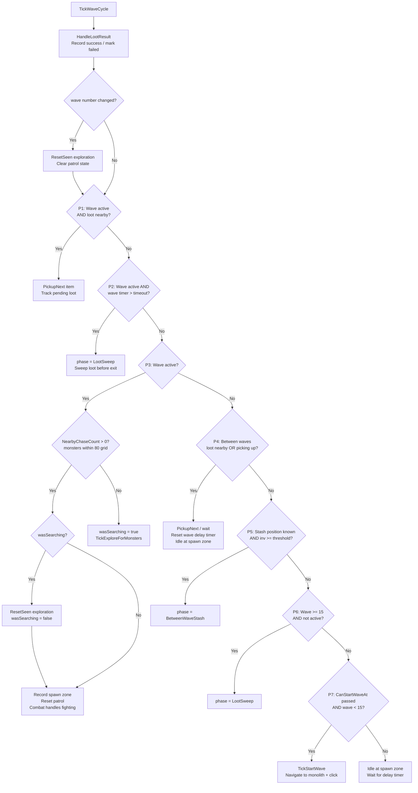
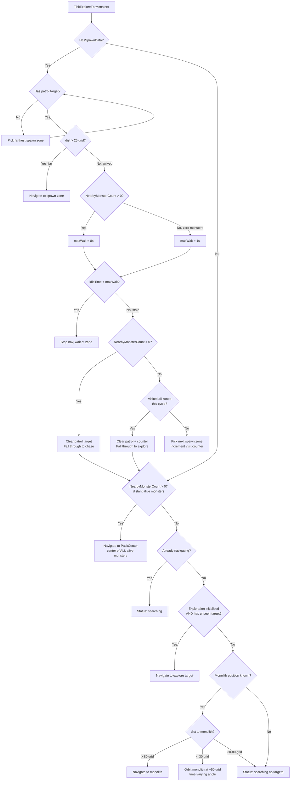
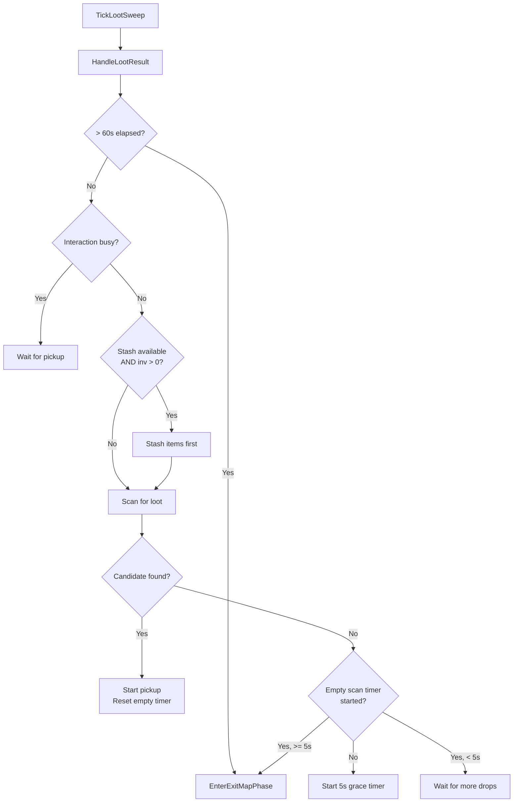

# Simulacrum Mode Flowchart

## Phase State Machine (Top Level)

## Area Change Handler

## WaveCycle Decision Loop (Core Logic)

## TickExploreForMonsters (Monster Search)

## LootSweep (Post-Wave/Timeout)

## Key State Transitions Summary

| From | To | Trigger |
|------|-----|---------|
| InHideout | StashItems | Has inventory items |
| InHideout | OpenMap | Inventory empty |
| StashItems | OpenMap | Stash succeeded/failed |
| OpenMap | (area change) | MapDevice portal entered |
| FindMonolith | NavigateToMonolith | Monolith entity found |
| NavigateToMonolith | WaveCycle | Within 18 grid of monolith OR wave already active |
| WaveCycle | LootSweep | Wave timeout OR wave 15 complete |
| WaveCycle | BetweenWaveStash | Between waves, inv >= threshold |
| BetweenWaveStash | WaveCycle | Stash done/failed OR wave started |
| LootSweep | ExitMap | 5s no loot OR 60s timeout |
| ExitMap | (area change) | Portal clicked, enter hideout |
| (area change to hideout) | InHideout | mapCompleted OR too many deaths |
| (area change to hideout) | EnterPortal | Death under limit |
| (area change to map) | FindMonolith | Always |

## Exploration Reset Points

| When | Why |
|------|-----|
| Wave number changes | New wave = new monster spawns in visited areas |
| Search → Combat transition | Found monsters after searching; next search needs fresh sweep |
| `ResetSeen()` clears SeenCells + FailedRegions | Blob/region structure preserved, only visibility reset |
