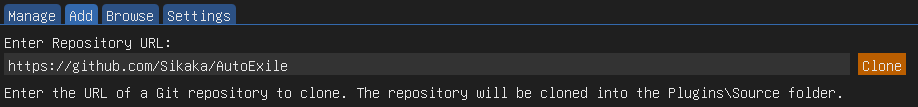
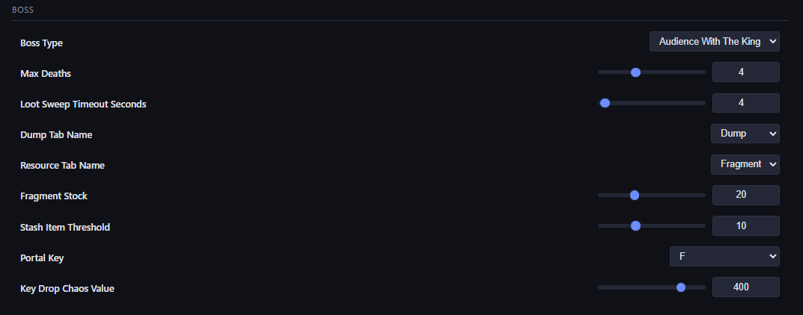

# AutoExile

An ExileCore plugin that automates Path of Exile farming. Run maps, farm bosses, clear simulacrums, or follow a party leader — all configurable through a web dashboard you can control from your phone.

## Getting Started

### Requirements
- [ExileApi](https://github.com/exApiTools/ExileApi-Compiled/) (latest version)
- [Get-Chaos-Value](https://github.com/DetectiveSquirrel/Get-Chaos-Value) plugin for item pricing (recommended)

### Installation

1. Open ExileApi
2. Go to the **Plugin Updater** → **Add** tab
3. Paste the repository URL and click **Clone**:



The updater will download, compile, and keep the plugin up to date automatically.

### First-Time Setup

1. Open the web dashboard at `http://localhost:9876` or use the ExileCore settings panel
2. Configure your **Build Settings** — set your movement key, assign skill slots, and configure flasks
3. Pick a farming mode and configure its settings
4. Press **Insert** in-game to start the bot

## Farming Modes

### Simulacrum (Stable)
AFK farm all 15 waves of Simulacrum. The bot handles combat, monolith activation, death recovery, between-wave stashing, and looting at the end. Works best with strong builds that can clear waves without much manual intervention.

### Boss Farming (Stable)
Automated boss kill loops — the bot handles the full cycle of stashing loot, withdrawing fragments, opening the map device, entering the portal, fighting the boss, looting, and exiting. Runs continuously until you're out of fragments.

Supported bosses:
- **Oshabi, Avatar of the Grove** — Sacred Blossom fights
- **Audience With The King** — Voodoo King encounters including the maze phase
- **Incarnation of Fear** — Uber Anger boss (requires a very strong build)

### Blight (Stable)
Automated blight encounters with tower placement, lane management, and post-timer cleanup. Works well with AFK and minion-style builds.

### Follower (Stable)
Follow a named party leader through zones. Useful for leveling alt characters or running an aura bot alongside your main.

### Mapping (Experimental)
Automated map farming with exploration, combat, and looting. Currently supports Ultimatum encounters as the primary test mechanic. **This mode is for testing only** — expect rough edges.

## Web Dashboard

AutoExile includes a built-in web server that lets you monitor and control the bot from any browser, including your phone. View live status, change settings, and check session stats without alt-tabbing.

The dashboard is available at `http://localhost:9876` by default (port is configurable). Enable network access in settings to connect from other devices on your network.

## Configuration

All settings are managed through the web dashboard or ExileCore's settings panel. Key sections:

- **Build** — Movement key, skill slots (roles, conditions, priorities), flask setup, blink range
- **Loot** — Pickup radius, minimum chaos value per slot, unique pricing thresholds
- **Mode Settings** — Each farming mode has its own section with mode-specific options
- **Boss** — Boss type selection, fragment stock, stash tab names, loot sweep timeout, max deaths



Each skill slot supports conditions like buff/debuff checks, enemy count thresholds, rarity filters, and range limits. Use the built-in **Buff Scanner** to discover buff names from live gameplay.

## Hotkeys

| Key | Action |
|---|---|
| Insert | Start / Pause / Resume the bot |
| F6 | Dump game state (terrain, exploration, pathfinding) to image + JSON |
| F7 | Dump recording |

Hotkeys are rebindable through settings.

## Community

Join the [Discord](https://discord.gg/jTQSWdmsh) to help test new features, share feedback, and follow development progress. You'll also find documentation on the AI-assisted development process behind the project.

Note: This is a testing and feedback channel, not a tech support helpdesk.

## Building from Source

For contributors who want to build manually instead of using the plugin updater:

```
dotnet build
```

Targets .NET 10.0 (Windows).
